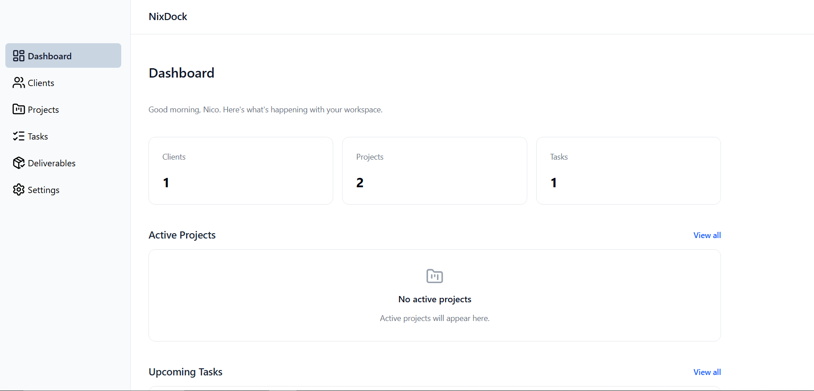
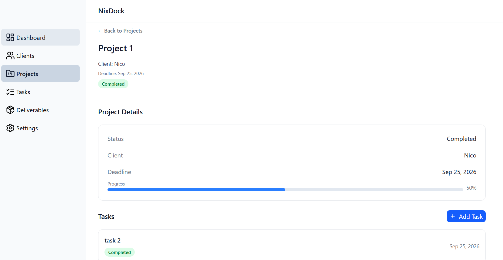
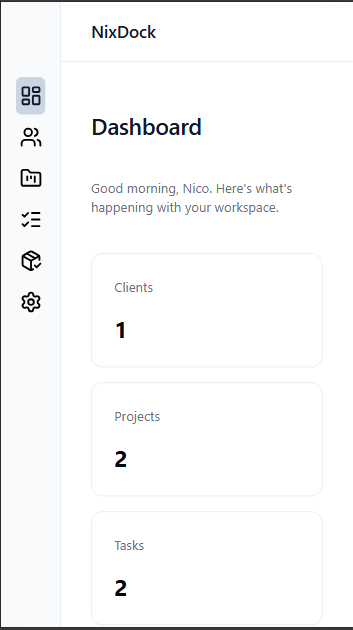
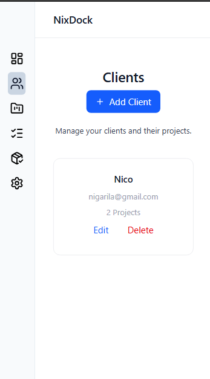

# NixDock

NixDock is a workspace management platform for freelancers and small service businesses. It helps users manage clients, projects, tasks, deadlines, and deliverables in one place.

## Features

- Client management
- Project management
- Task management
- Deliverable tracking
- Task-based project progress
- Form validation
- Client → Project → Task/Deliverable relationships
- Cascade deletion for related data
- Persistent data using localStorage
- Responsive design

## Tech Stack

- React
- React Router
- Tailwind CSS
- Vite
- JavaScript
- Lucide React

## Key Implementation Details

- Shared application state is managed in `RootLayout` and passed to routes using React Router's `Outlet` context.
- Application data is persisted to `localStorage` so changes remain after refreshing the page.
- Project progress is calculated dynamically from completed tasks instead of being stored separately.
- Related tasks and deliverables are automatically removed when their parent project is deleted.
- Deleting a client also removes its associated projects, tasks, and deliverables.
- Detail pages use dynamic routes and URL parameters to display specific resources.
- Forms support both creating and editing records using reusable form components.
- Date validation prevents tasks and deliverables from exceeding their project's deadline.

## Getting Started

### Prerequisites

- Node.js
- npm

### Installation

Clone the repository and install the dependencies:

```bash
git clone https://github.com/nico-devstudio/nixdock.git
cd nixdock
npm install
```

### Run the development server

```bash
npm run dev
```

The application will be available at the local URL provided by Vite.

## Screenshots

### Desktop




### Mobile




## Future Improvements

- Backend API and database integration
- User authentication
- Multi-user workspaces
- Real-time updates
- File uploads for deliverables
- Notifications and reminders
